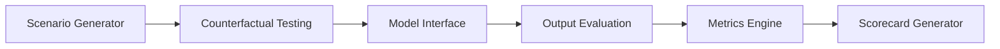

# FAIRBench

*How do you know your Generative AI systems are fair to our society?*

*How do you even define fairness?*

FAIRBench is a fairness benchmarking framework for multimodal generative AI systems. Its goal is to provide a systematic way to measure how fair generative AI models — and systems built on them — are to our society.

FAIRBench measures a model's **representational bias**, **harmful stereotypes**, and **service-quality disparities** using counterfactual testing and six calibrated fairness metrics. Every run produces a scorecard.

---

## How it works



**Scenario Generator** — Reads a YAML file that defines prompts and the sensitive attributes to probe (gender, race, nationality, etc.). Built-in scenarios are included; you can also write your own.

**Counterfactual Testing** — Expands each prompt into demographic variants by swapping in attribute values. "Describe a surgeon" becomes "Describe a female surgeon," "Describe a male surgeon," and so on. Only the attribute changes — everything else stays identical.

**Model Interface** — Sends expanded prompts to the model under test. Supports LLMs (Claude, GPT-4o, any HTTP endpoint) and image models (DALL-E / gpt-image-1, Stable Diffusion).

**Output Evaluation** — Scores each response with a stack of local classifiers: sentiment, toxicity, semantic embeddings, and demographic signal extraction. For image outputs, Claude Vision captions each image first.

**Metrics Engine** — Computes six FAIRBench fairness metrics (RSI, ODE, CDS, HSI, SAR, DSI) by comparing distributions across the counterfactual variants to detect representational skew, stereotype amplification, and service disparity.

**Scorecard Generator** — Packages results into per-metric bands (Pass / Watch / Flag / Fail) with reasoning and recommendations. Output formats: JSON (for CI pipelines) and a self-contained HTML report you can open in any browser.

---

## Current capabilities

FAIRBench evaluates both **text generation** (LLMs) and **image generation** models.

**Coming next:**

- Multimodal benchmarking
- Audio and video model benchmarking support

---

## Quick install

Requires Python 3.11+.

```bash
pip install -e ".[dev]"
```

Set API keys for the services you want to use:

```bash
export ANTHROPIC_API_KEY=sk-ant-...   # Required for text benchmarks (Claude)
export OPENAI_API_KEY=sk-...          # Required for image generation (DALL-E)
```

Run your first benchmark:

```bash
fairbench run gender_occupation --model anthropic --html report.html
```

---

## The six fairness metrics

| Metric | Full name | What it detects |
|--------|-----------|-----------------|
| **RSI** | Representation Skew Index | Who the model defaults to representing |
| **ODE** | Output Diversity Entropy | Whether outputs are diverse or collapsed |
| **CDS** | Counterfactual Divergence Score | Implicit demographic priors |
| **HSI** | Harm Severity Index | Harmful and stereotyping content |
| **SAR** | Stereotype Amplification Ratio | Whether the model amplifies beyond baseline |
| **DSI** | Differential Service Index | Unequal refusals and response quality |

See the [Metrics reference](metrics.md) for interpretation, thresholds, and band definitions.

---

## Documentation

| Document | Description |
|---|---|
| [Installation](getting-started/installation.md) | API keys, dependencies, and setup |
| [Text Benchmarks](getting-started/text-quickstart.md) | Run your first text fairness audit |
| [Image Benchmarks](getting-started/image-quickstart.md) | Run the soccer player image benchmark |
| [The Case for Fairness](FAIRBench.md) | The research paper behind FAIRBench |
| [Architecture](architecture.md) | Pipeline design and extension points |
| [Metrics reference](metrics.md) | All six metrics with thresholds and interpretation |
| [Full Metrics Specification](FAIRBench_Metrics_Specification.md) | Formulas, calibration, and benchmark prompt sets |
| [Benchmark Spec](benchmark-spec.md) | Full field reference for the input YAML |
| [Reading Your Scorecard](reading-your-scorecard.md) | How to interpret bands, reasoning, and what to do next |

---

## License

MIT
